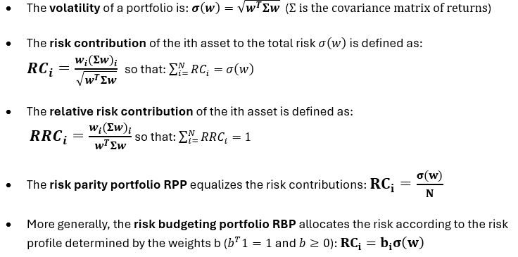
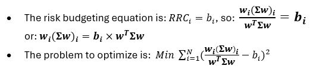

# Risk-Parity-Model
The Risk Parity model is a portfolio optimization strategy that focuses on the allocation of risk rather than capital. As a result, the portfolio is well-diversified and more resilient to market downturns.

